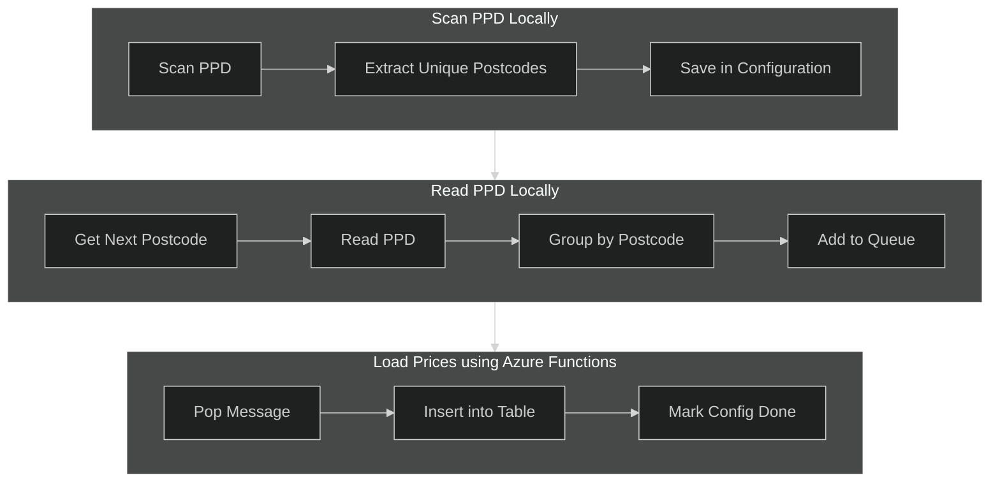

# Purple-V2: Create a Query Endpoint for Accessing UK Property Prices by Postcode
Requirement:  
Create sets of UK Property Prices, grouped by Postcode, to be queried by a sample web application.
  
## Azure
There are three components:  
1. Create the Postode list as configuration
    - Run a Python function locally to Create a unique list of postcodes in the PPD file
    - Save the postcode list in a configuration table in Azure Table Storage
2. Scan the PPD file for each postcode in the configuration
    - Read the configuration for the next postcode to process
    - Run a Python function locally to search the full PPD file and group the property prices for each address into a single dataset
    - Store the dataset in an Azure Storage Queue for later processing
3. Load the Postcode dataset into a Database
    - Create an Azure Storage Table to contain property prices.  Partition by Postcode and Address
    - Create an Azure Function to read Queue messages and insert the prices into the Table

<br>




## Environment
[Setup a new WSL environment with Debian, Pyhon3.11, Azure CLI, Dotnet and Function Core Tools](environment.md)  
<br>

## Python Setup
Use the latest supported version as defined by the [Microsoft Docs](https://learn.microsoft.com/en-us/azure/azure-functions/supported-languages?tabs=isolated-process%2Cv4&pivots=programming-language-python#languages-by-runtime-version).  This is currently 3.11.  
We will be using the [Python v2](https://learn.microsoft.com/en-us/azure/azure-functions/create-first-function-cli-python?tabs=linux%2Cbash%2Cazure-cli&pivots=python-mode-decorators) programming model (apologies for the name clash with this purple project).  

We wil NOT be using the VS Code Azure Functions extension as we will be using the Azure CLI from WSL, and we wil NOT be using the Azurite node based Azure storage emulator.  

### Setup pip and venv.
```python
sudo apt-get install python3-venv
sudo apt install python3-pip
```

### Setup a Virtual Environment.  
From within the *src* code directory, add the **.venv** folder and activate a new virtual environment called 'v2'.  This gives us a clean python starting point.   
```python
cd src
mkdir .venv
python3 -m venv .venv/v2
source .venv/v2/bin/activate
```
Add the required Azure SDK libs.
```
py -m pip install azure-data-tables
py -m pip install azure-storage-queue
```

### Python Module Folders
The there components to our application use a combination of local functions and an Azure Function App (of Python functions).  To ensure we can deploy the Azure Function App, it needs to be in a seperate folder to isolate the deployable code.    
```
mkdir azure
mkdir local
```

