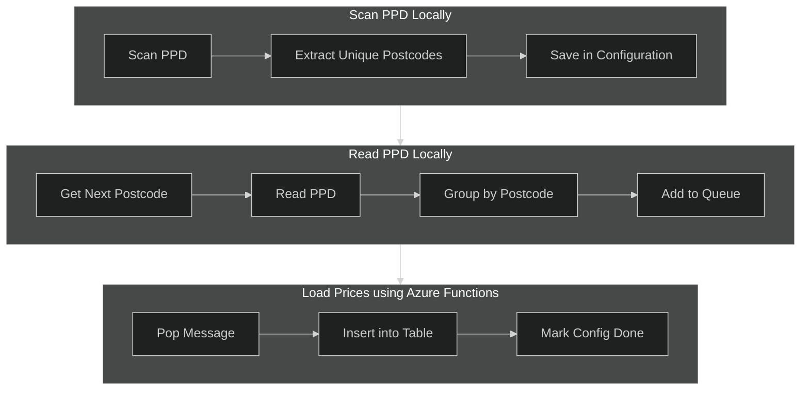

# Purple-V2: Create a Query Endpoint for Accessing UK Property Prices by Postcode
Requirement:  
Create sets of UK Property Prices, grouped by Postcode, to be queried by a sample web application.  

[](https://github.com/andyvroberts/purple/actions/workflows/funcapp.qt.cs.deploy.yml)


## Project Structure  
The project has 3 components.  The Ingest folder is for data acquisition and populating price records at the postcode grouping.  The Server folder is for a data API that allows clients to retrieve price data based on a postcode lookup.  The Present folder contains a simple Web App which is the UX.  
```bash
├── ingest
│   ├── file_scanner-py
│   │   └── src (local price file scan using python cli)
│   ├── queue-trigger-cs
│   │   └── src (function app)
│   └── queue-trigger-py
│       └── src (function app)
├── platform
│   └── az (bicep and azure cli files)
├── present
└── serve
```

The ingest folder has 2 sub-folders. The 'local' one contains python code that runs locally.  The 'azure' one contains a Python function app.  


### 1. Ingest
There are three components:  
1. Create the Postode list as configuration
    - Run a Python function locally to Create a unique list of postcodes in the PPD file
    - Save the postcode list in a configuration table in Azure Table Storage
2. Scan the PPD file for each postcode in the configuration
    - Read the configuration for the next postcode to process
    - Run a Python function locally to search the full PPD file and group the property prices for each address into a single dataset
    - Store the dataset in an Azure Storage Queue for later processing
3. Load the Postcode dataset into a Database
    - Create an Azure Storage Table to contain property prices.  Partition by Postcode and Address
    - Create an Azure Function to read Queue messages and insert the prices into the Table

<br>




