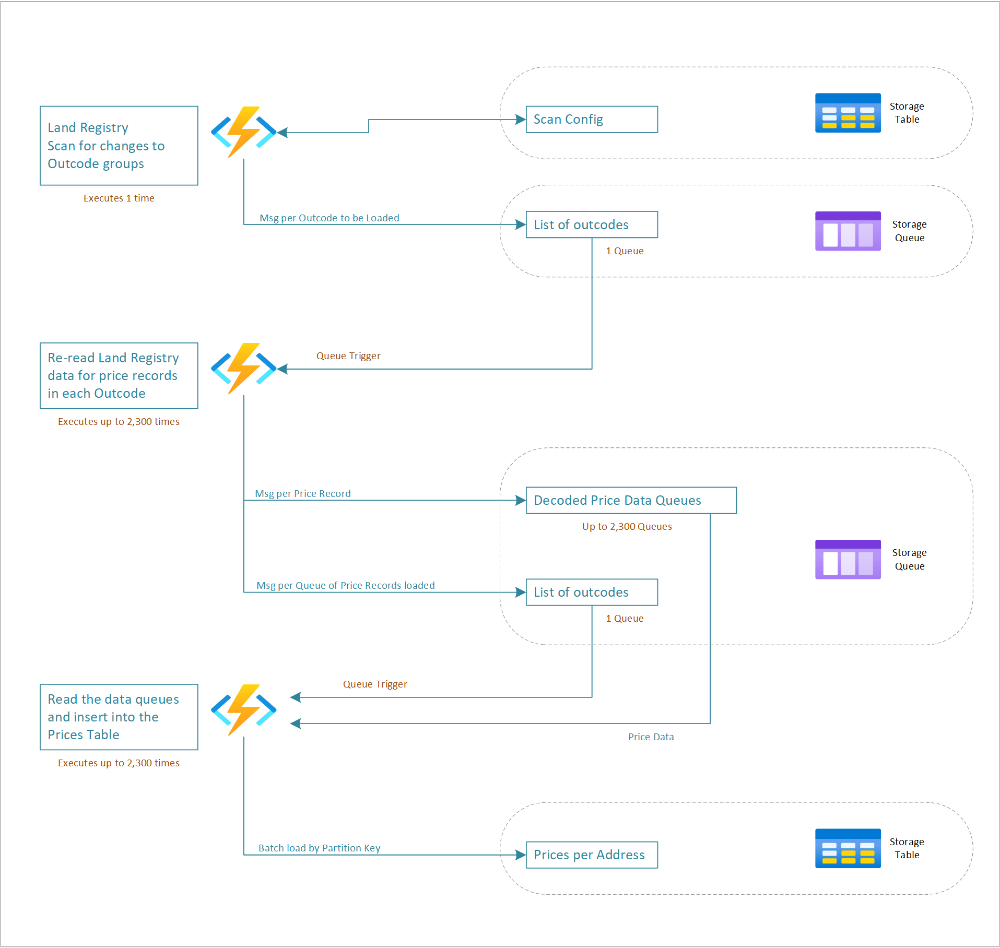

# Ingest Historical Land Registry Property Prices
Ingest the UK land registry update file of sold residential property prices.  Store them in table storage.  Create the application using Python.

## Application Design
[Read this file for the requirements, design choices and changes throughout the implementaton process](design.md)  

## Useful Information
### 1. Dotnet
Setup the dotnet and Azure SKD's before you do anything else.  
[Read this file for Azure setup and configuration](azure.md)  

### 2. Python
[Read this file for Python setup and configuration](python.md)  

### 3. Deploy an Aure Function App
[Read this file for CLI commands to create resources and the Functions Core Tools Deploy command](funcapp.md) 

# Design Diagram

## Execution Observations
### Function Timeouts
Sometimes a function app will timeout for an unknown reason. In these cases:
- load the same file again but..
- edit the configuration table and update the 'Total' column to zero for the outcodes impacted
- this will force re-execution at the next timer triggered process

### Queue Costs
Loading a 900k row dataset results in queue costs of approximately £0.75 per load.  Although this is by no means high, compared to table storage costs (£0.04) it is an order of magnitude larger.  We need to investigate queue storage options to see why this is the case.  

### Design Suitability
This design is just an interesting excercise using queue's and table storage.  For production purposes (or if you have plenty of Azure credits) the correct approach would be to use a data-lake and data warehouse clustered compute appliance such as Databricks or Synapse analytics.  

So, even though there is not much code in this demonstration, there is still far more than you would need to write if you followed the expected process of:
- downloading the entire source dataset
- grouping, sorting and filtering in-memory
- producing the output records in a single pass

The end.  

