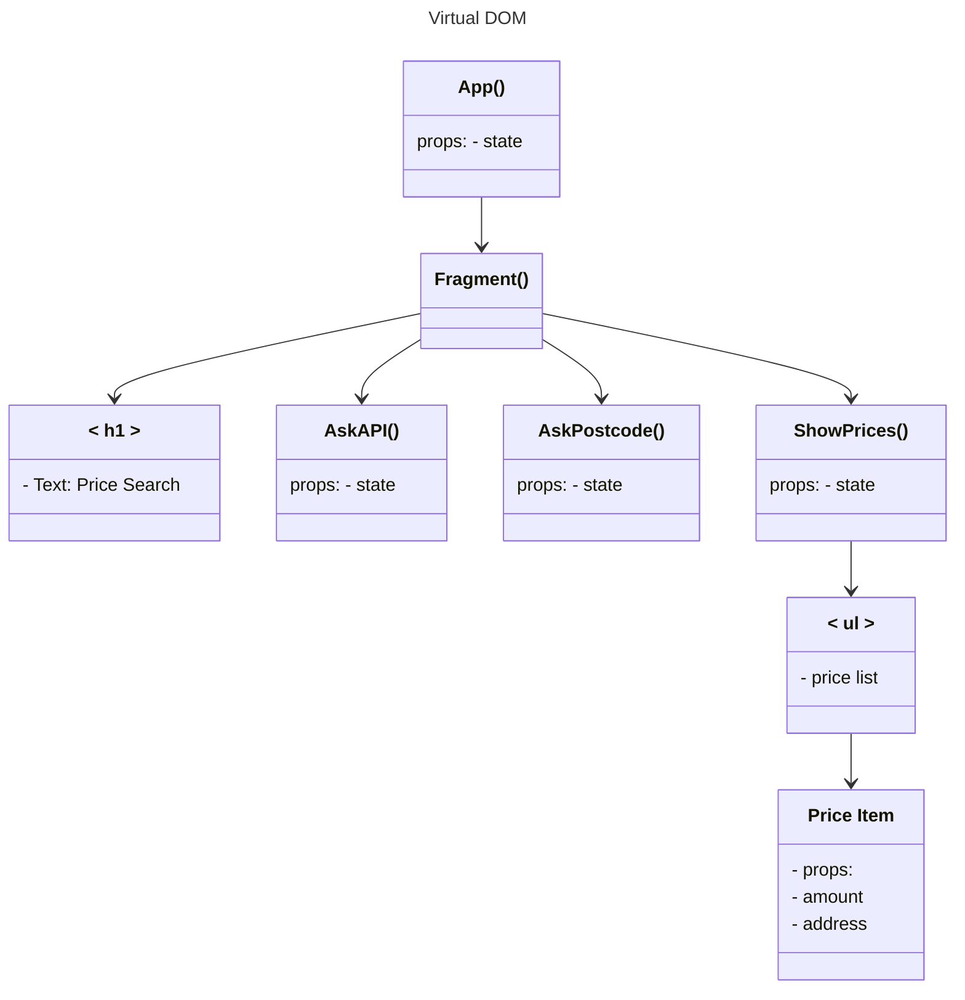

# UI
## Javascript Env
Install the webserver and js exection environment.  

```
sudo apt-get install nodejs
sudo apt-get install npm
OR
doas apk install nodejs
doas apk install npm
```
Install the Serve command.  
```
sudo npm install --global serve
OR
doas npm install --global serve
```
Now you can run a JS project in folder.  
```
cd folder_name/
npx serve
```

## Layout
**API Section - AskAPI()**  
One temporary text box for input:  
- URL with api key

**Search Section - AskPostcode()**  
Two text boxes for input:  
- Outcode 
- Postcode (active if outcode has 2 chars)
  
**Bottom Section - ShowPrices()**  
List of Prices returned from an API call


**Diagram of the object model Layout:**



<br>

Mermaid code:
```
%%{init: {'theme':'dark'}}%%
```